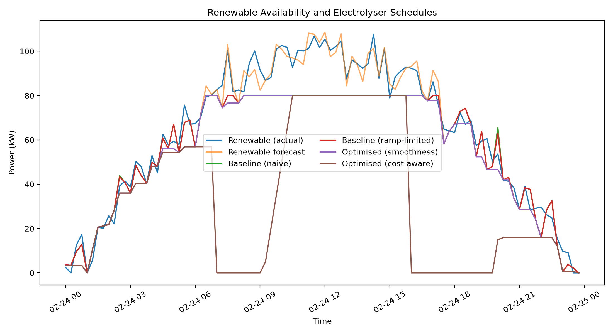
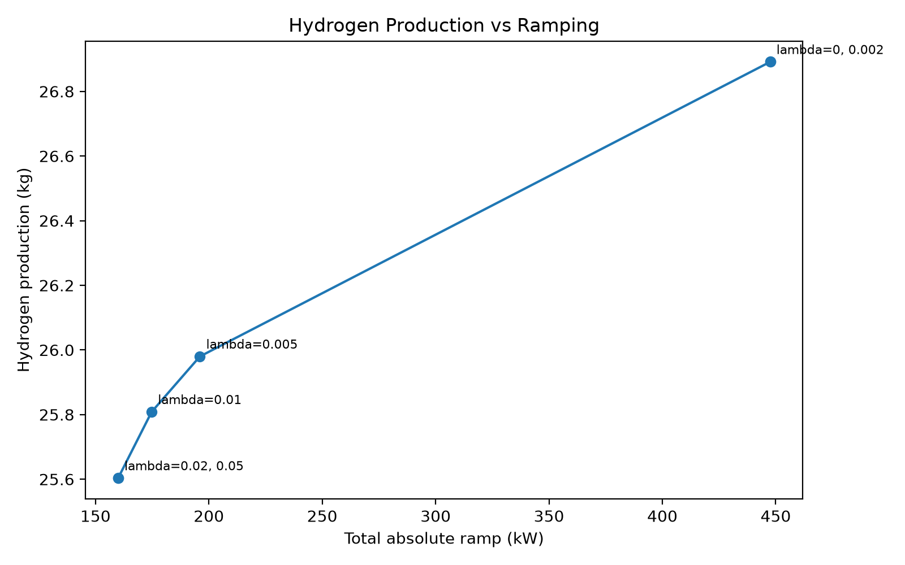
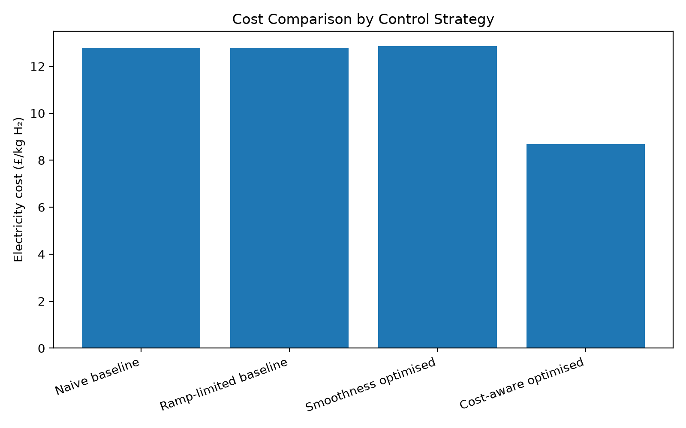

# Renewable-Powered Hydrogen Electrolyser Optimisation

A reproducible Python case study that schedules an electrolyser against variable renewable availability and time-varying electricity prices. It compares simple control baselines with two linear-programming strategies: one balances hydrogen yield against power ramping, and the other balances electricity cost, hydrogen value, and ramping.

> This is a synthetic portfolio model, not a plant-design or investment model. The numerical results demonstrate the optimisation workflow under the assumptions below; they are not claims about a real facility.

## What the project demonstrates

- translating physical and commercial assumptions into an optimisation model;
- building fair baseline comparisons;
- formulating absolute ramp penalties with auxiliary variables;
- using SciPy's HiGHS linear-programming solver;
- running sensitivity analysis and exporting reproducible evidence; and
- testing unit conversion, determinism, and operational constraints.

## Model formulation

The study uses a 24-hour horizon divided into 96 15-minute intervals. At each interval, electrolyser power is bounded by both its 80 kW capacity and the renewable forecast:

```text
0 <= power[t] <= min(80 kW, renewable_forecast[t])
power[t] - power[t-1] <= 15 kW
```

The 15 kW constraint applies to upward changes. Faster downward curtailment is allowed when renewable availability falls. Hydrogen output is calculated from interval energy, 65% conversion efficiency, and a lower heating value of 33.33 kWh/kg.

The two optimisation objectives are:

1. **Smoothness-aware:** maximise hydrogen output minus a weighted absolute-ramp penalty.
2. **Cost-aware:** minimise electricity cost plus ramping cost minus the assumed value of hydrogen.

The cost-aware case uses a synthetic hydrogen value of £12/kg and a ramping penalty of £0.05 per kW of absolute change. All assumptions are centralised in `src/config.py` and exported to `results/assumptions.json` on each run.

## Reproducible example results

The committed outputs use random seed 42. Results are rounded for display.

| Strategy | Hydrogen (kg) | Energy (kWh) | Total absolute ramp (kW) | Electricity cost (£) | Cost (£/kg H₂) |
|---|---:|---:|---:|---:|---:|
| Naive baseline | 26.91 | 1,379.68 | 453.72 | 343.93 | 12.78 |
| Ramp-limited baseline | 26.89 | 1,378.91 | 447.54 | 343.79 | 12.78 |
| Smoothness optimised (lambda = 0.005) | 25.98 | 1,332.17 | 196.05 | 333.91 | 12.85 |
| Cost-aware optimised | 15.23 | 780.84 | 309.02 | 132.31 | 8.69 |

Under this synthetic scenario, the selected smoothness solution reduces total absolute ramping by **56.2%** relative to the ramp-limited baseline while producing **3.4% less hydrogen**. The cost-aware solution reduces electricity cost per kg by **32.0%** relative to the naive baseline, while also producing less hydrogen. These are model outputs, not observed operational savings.







## Run the analysis

Python 3.10 or later is recommended.

```bash
python -m venv .venv
```

Activate the environment, then install and run:

```bash
python -m pip install -r requirements.txt
python main.py
```

To save results somewhere else:

```bash
python main.py --output-dir path/to/results
```

Run the automated checks with:

```bash
python -m unittest discover -s tests -v
```

## Repository structure

```text
.
|-- main.py                       # end-to-end analysis entry point
|-- requirements.txt
|-- src/
|   |-- baseline.py               # naive and ramp-limited controls
|   |-- config.py                 # model assumptions
|   |-- data_simulation.py        # seeded renewable profile
|   |-- electrolyser_model.py     # energy-to-hydrogen conversion
|   |-- evaluation.py             # production, ramp, and cost metrics
|   |-- forecasting.py            # seeded forecast uncertainty
|   |-- optimisation_engine.py    # HiGHS linear programmes
|   |-- plotting.py
|   `-- pricing.py                # synthetic time-varying prices
|-- tests/test_model.py
`-- results/                      # generated CSV, JSON, and PNG outputs
```

## Limitations and next steps

- Renewable availability, forecast error, and prices are simulated rather than sourced from an operational dataset.
- The model assumes constant electrolyser efficiency and continuous operation between 0 and 80 kW; it does not model minimum stable load, start-up, minimum on/off time, degradation, storage, or grid exchange.
- Only upward ramping is constrained; downward curtailment is unrestricted.
- The forecast is a noisy synthetic series, not a trained forecasting model.
- The cost-aware objective depends on an assumed hydrogen value and ramp penalty, so it is a scenario comparison rather than a profit forecast.

Useful extensions would include real weather and price data, a piecewise efficiency curve, storage state-of-charge, start-up costs, rolling-horizon re-optimisation, and out-of-sample scenario testing.
